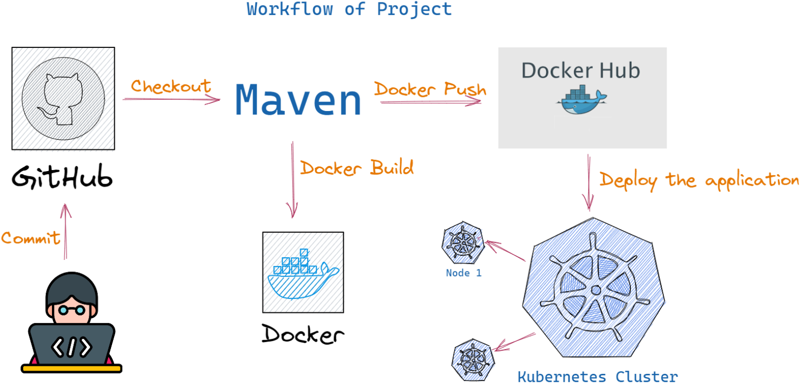

# 🚀 Java Microservices Deployment using Docker & Kubernetes

Deploying a Java microservices application on Kubernetes using **Docker**, **Docker Hub**, **Minikube**, and **Kubernetes Deployments & Services**.

---

## 📖 Project Overview

This project demonstrates an end-to-end deployment of a Java microservices application by containerizing each service with Docker and deploying them on a Kubernetes cluster using Minikube.

The application consists of three independent microservices:

- 🛒 Shopfront
- 📦 Product Catalogue
- 📊 Stock Manager

Each microservice is built using Maven, containerized with Docker, and deployed using Kubernetes Deployments and Services.

---

# 🖼 Project Overview


---

# 🔄 Project Workflow



---

## 🛠 Tech Stack

- Java
- Maven
- Docker
- Docker Hub
- Kubernetes
- Minikube
- kubectl

---

## 📂 Project Structure

```text
.
├── productcatalogue/
├── shopfront/
├── stockmanager/
├── k8s/
├── images/
└── README.md
```

---

## 🐳 Docker Images

| Microservice | Docker Image |
|--------------|--------------|
| Product Catalogue | `bhushanpatil/productcatalogue:v1` |
| Stock Manager | `bhushanpatil/stockmanager:v1` |
| Shopfront | `bhushanpatil/shopfront:v1` |

---

## 🚀 Build Java Applications

Build each Java microservice using Maven.

```bash
cd productcatalogue
mvn clean install -DskipTests

cd ../stockmanager
mvn clean install -DskipTests

cd ../shopfront
mvn clean install -DskipTests
```

---

## 🐳 Build Docker Images

```bash
docker build -t bhushanpatil/productcatalogue:v1 ./productcatalogue

docker build -t bhushanpatil/stockmanager:v1 ./stockmanager

docker build -t bhushanpatil/shopfront:v1 ./shopfront
```

---

## ☸ Deploy to Kubernetes

Deploy all Kubernetes manifests.

```bash
kubectl apply -f k8s/
```

---

## ✅ Verify Deployment

```bash
kubectl get pods

kubectl get svc

kubectl get deployments

kubectl get all
```

---

## 🌐 Access the Application

```bash
minikube service shopfront
```

Or

```bash
minikube ip
```

Open:

```text
http://<MINIKUBE-IP>:30010
```

---

# 📸 Project Screenshots

## Kubernetes Resources

Successful creation of Kubernetes Deployments and Services.


---

## Running Pods

All three Java microservices running successfully on the Kubernetes cluster.


---

## Application Output

Java Shopfront application successfully deployed and accessible through Kubernetes.


---

## 🎯 Key Learning Outcomes

- Built Java microservices using Maven
- Containerized applications with Docker
- Created Docker images from Dockerfiles
- Deployed applications on Kubernetes using Minikube
- Created Kubernetes Deployments and Services
- Exposed applications using NodePort
- Verified Kubernetes resources using `kubectl`
- Debugged and resolved CrashLoopBackOff issues

---

## 📚 Useful Commands

```bash
kubectl get pods

kubectl get svc

kubectl get deployments

kubectl get all

kubectl logs <pod-name>

kubectl describe pod <pod-name>

minikube service shopfront
```

---

## 🙏 Acknowledgements

This project was completed as a hands-on learning exercise to strengthen practical experience in Docker, Kubernetes, and Java microservices deployment.

---

⭐ If you found this project useful, consider giving it a Star!
